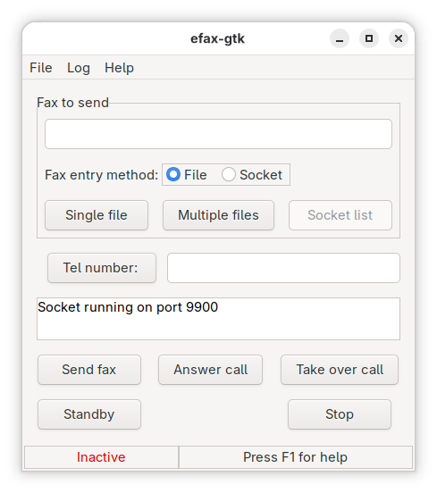

# Efax-gtk

___Faxing with Linux/Unix___

Efax-gtk is a GUI front end for the 'efax' fax program. It can be used to send and receive faxes with a fax modem, and to view, print and manage faxes received. It also has a socket interface to provide a "virtual printer" for sending faxes from word processors and similar programs, and can automatically e-mail a received fax to a designated user, and automatically print a received fax.



---

## Manual Install and Run

Make sure you follow the [setup guide for your Linux distribution](https://flathub.org/en/setup) before installing.

```
flatpak install flathub net.sourceforge.efaxgtk
flatpak run net.sourceforge.efaxgtk
```

## Building

```
git clone git@github.com:flathub/net.sourceforge.efaxgtk.git
flatpak run org.flatpak.Builder build-dir --user --ccache --force-clean --install net.sourceforge.efaxgtk.json
```

---

**Technologies**: GNOME, GTK3, Efax, C
